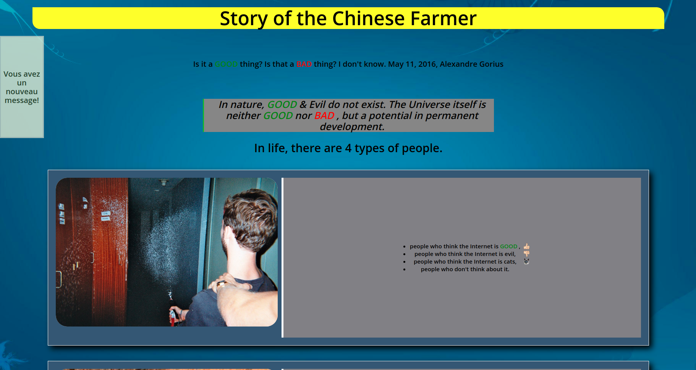
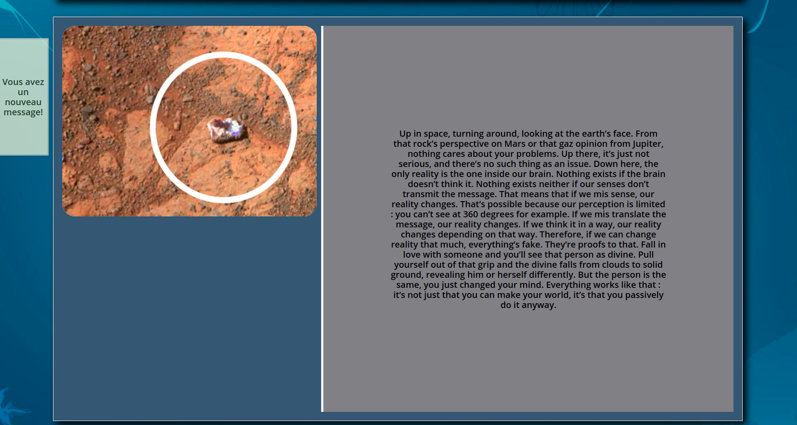
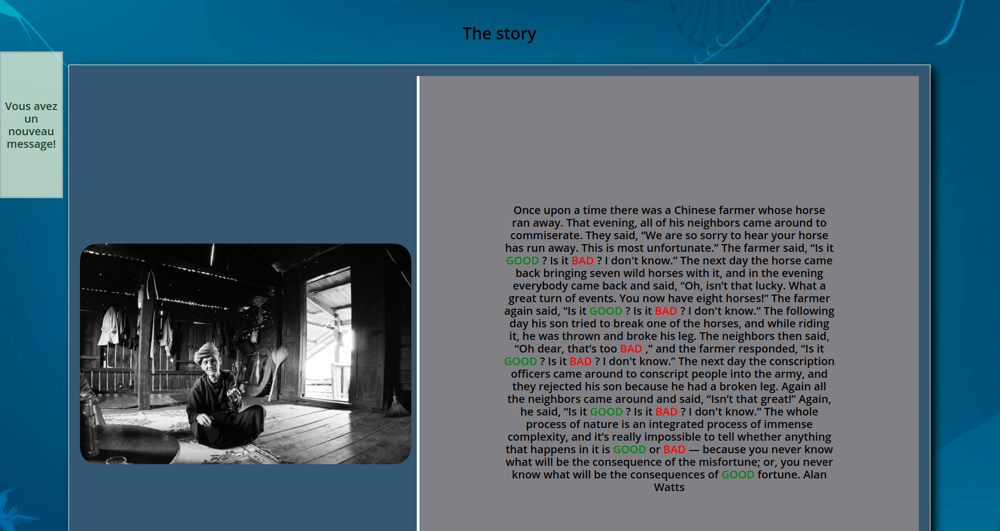
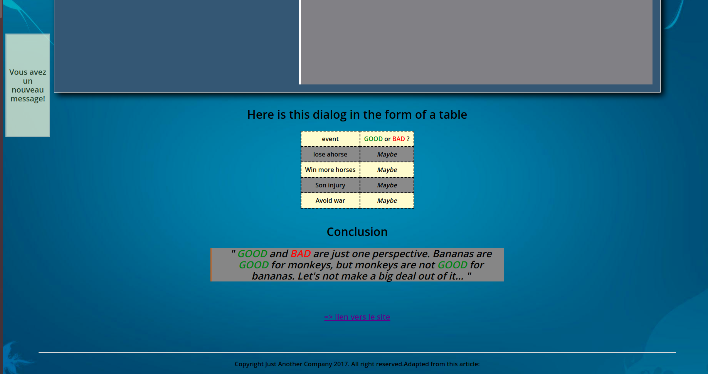

# The Story of the Chinese Farmer

* Projet fait par : Jniouen Wassim

* Dans le but d'un exercice pour ma formation   Web "Becode"

---------------------------------------------

## Date du projet 

* Projet commencé le lundi 26 octobre 2020 et   terminer le mercredi 28 octobre 2020

---------------------------------------------

## Les consignes

[ => lien des consignes](https://github.com/becodeorg/bxl-hopper-1-25/tree/master/The%20Field/3.HTML%2BCSS/0.progressive_enhancement)

---------------------------------------------

## Languages utilisés + objectif

* HTML5

* CSS3

### Apprendre les bases du HTML et du CSS

---------------------------------------------

## Mon projet

[ => lien de mon projet ](https://jniouen-wassim.github.io/progressive-enhancement/)

---------------------------------------------

## Screenshots de mon projets :

